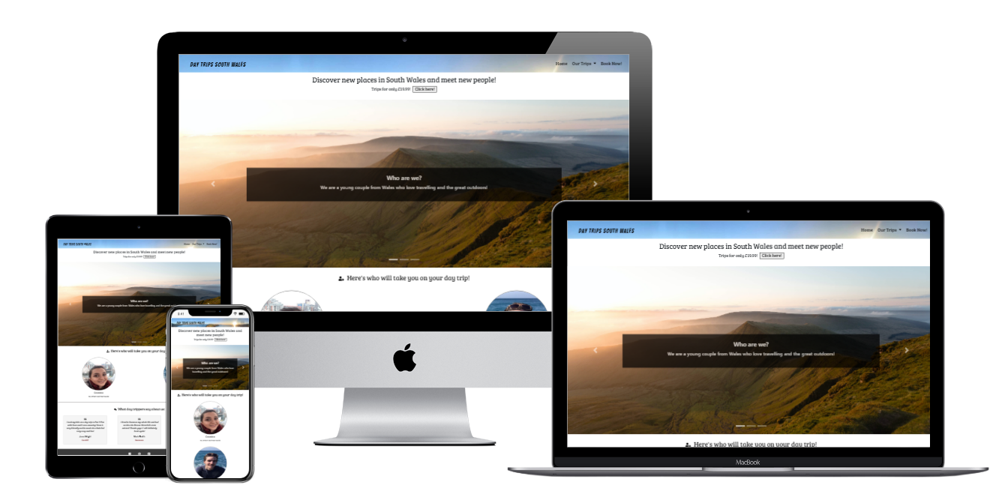
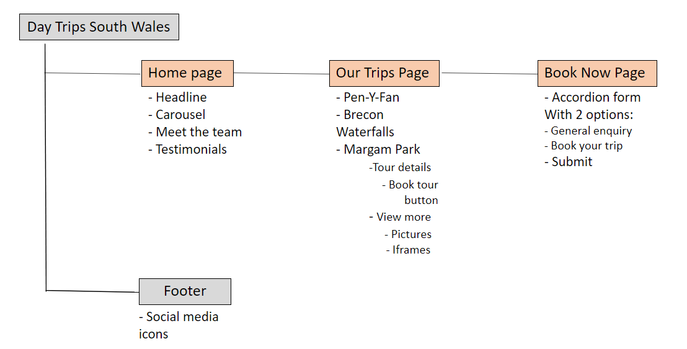
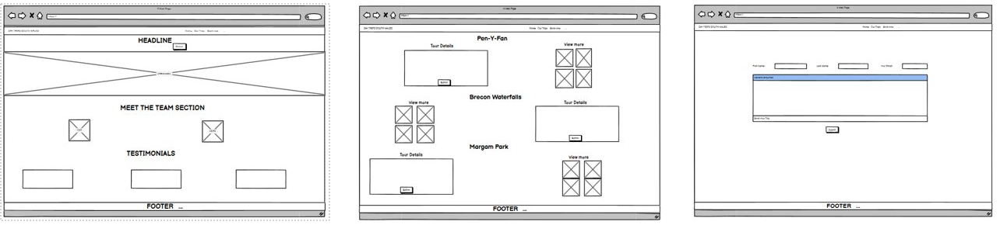
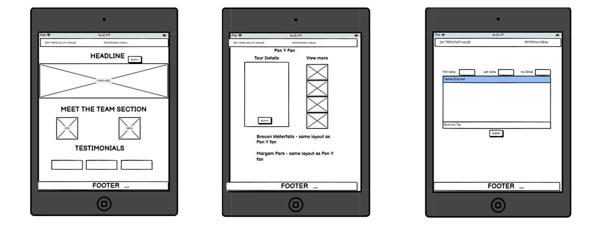
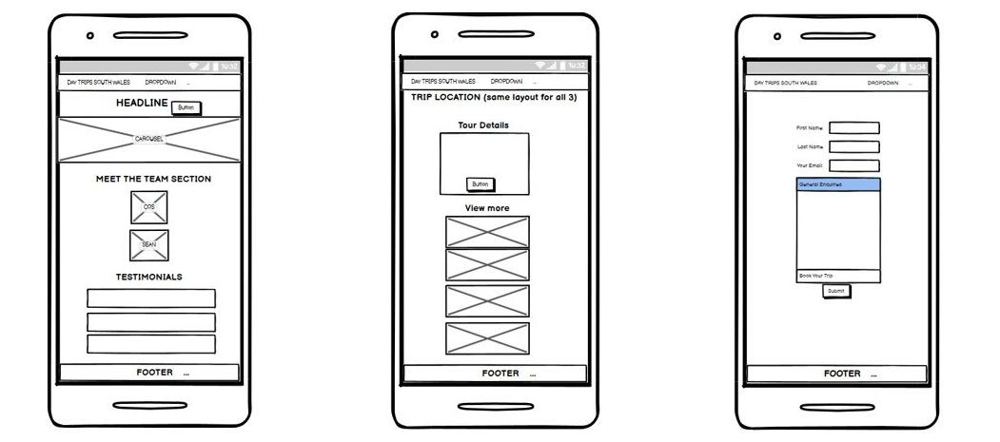

# Day Trips South Wales



[View the live project here](https://cosminaserbanica.github.io/CI-MS1-DayTripsSouthWales/)

## Table of contents
1. [Introduction](#Introduction)
2. [UX](#UX)
    1. [Ideal User Demographic](#Ideal-User-Demographic)
    2. [User Stories](#User-Stories)
    3. [Development Planes](#Development-Planes)
    4. [Design](#Design)
3. [Features](#Features)
    1. [Design Features](#Design-Features) 
    2. [Existing Features](#Existing-Features)
    3. [Features to Implement in the future](#Features-to-Implement-in-the-future)
4. [Issues and Bugs](#Issues-and-Bugs)
5. [Technologies Used](#Technologies-Used)
     1. [Main Languages Used](#Main-Languages-Used)
     2. [Frameworks, Libraries & Programs Used](#Frameworks,-Libraries-&-Programs-Used)
6. [Testing](#Testing)
     1. [Testing.md](TESTING.md)
7. [Deployment](#Deployment)
     1. [Deploying on GitHub Pages](#Deploying-on-GitHub-Pages)
     2. [Forking the Repository](#Forking-the-Repository)
     3. [Creating a Clone](#Creating-a-Clone)
8. [Credits](#Credits)
     1. [Content](#Content)
     2. [Media](#Media)
     3. [Code](#Code)
9. [Acknowledgements](#Acknowledgements)
***
## Introduction

This website was designed for a fictional, but potential travel business based in South Wales whose main objective is organising day trips to famous landmarks. The purpose of the website is to create an online presence, allowing customers to find information about the business and the services provided. 

This is the first Milestone Project a student must complete as part of the Web Applications Development Program at Code Institute.

The main requirements were to make a responsive and static responsive website with a minimum of three pages using primarily **HTML5** and **CSS3**.


## UX 

### Ideal User Demographic
#### The ideal user of this website is:
- New customers
- Current customers

### User Stories
#### New Customer Goals:
1. As a new customer, I want to easily navigate through the website to find relevant information about the services provided.
2. As a new customer, I want to be able to find out easily what the business does and who provides the service.
3. As a new customer, I want to find out how the service is provided.
4. As a new customer, I want to easily find information about the quality of the service from previous customers.
5. As a new customer, I want to be able to see proof of the service, such as pictures, videos or locations.
6. As a new customer, I want to easily get in touch with the business to enquire additional information or to book the service.
#### Current Customers Goals:
1. As a current customer, I want to easily navigate through the content in order to book the service again.
2. As a current customer, I want to be able to get in touch easily with the business.
3. As a current customer, I want a dedicated area where my opinions on the service can be published.

### Development Planes
In order to develop and promote a customer-centric business whose main goal is to sell a service, the website has been designed based on:
#### Strategy
The targeted audience:
- Locals looking for a daily activity
- Locals looking to meet other people while exploring the landmarks
- Tourists visiting South Wales
- Outdoor lovers interested in nature
- Age group: suitable for any age group

The **user** can use the website to:
- Find information about the business and who runs it
- Find information about the service, such as tour details, pictures, videos and locations
- Find information about how the service has been provided from previous users
- Enquire additional information and book the service
- Get in touch with the business via social media platforms

The **business** can use the website to:
- Introduce themselseves to the user and promote the day trips options
- Add new trip options or update the service
- Attract new customers by sharing previous customers experiences
- Receive customer enquiries or booking requests
- Create an online presence in order to gain customer trust

#### Scope
After defining the strategy, the scope was developed based on the following requirements:
- **User Requirements**
     - The user will be looking for:
          - Information about what the business does
          - Information about who provides the service and how do they do it
          - Opinions on the service from previous users
          - Details of what the service includes and how the service looks like
          - Options on how to book the service or get in touch with the business
          - Options on which service to book
          - Find the business on social media
- **How the user requirements have been met**
     - The user will be able to:
          - Navigate through the site with minimum clicks in order to find the information they want
          - Be able to find links to external sites in order to:
               - Find pick-up/ drop off locations
               - Find out about additional activities provided by other business
               - Book additional activities
          - Get in touch with the business through a form that offers multiple options based on user intention
          - Get in touch with the business via social media links

#### Structure
With the previously identified strategy and scope, the ideal structure was agreed to match the following diagram:


#### Skeleton
**Skeleton** has been put together using [Balsamiq wireframes](https://balsamiq.com/ "Link to Balsamiq wireframes")
- Wireframes for desktop: 

- Wireframes for Ipad:

- Wireframes for smarthphone:


### Design

#### Colour Scheme
The main colours used throughout the website are Black for text and White for background for the first and second page. White font has been used on the Book Now page to be visible on the background image.


#### Typography
The fonts used are [Bangers](https://fonts.google.com/specimen/Bangers "Link to Bangers Google Font") for the Logo situated in the navbar with Cursive as the fallback in case of import failure and [Bree Serif](https://fonts.google.com/specimen/Bree+Serif "Link to Bree Serif Google Font") Bree Serif font  is used throughout the website with Sans Serif as the fallback font in case of import failure. 


#### Imagery
The imaages selected have been used with a main purpose of promoting the Welsh landmarks and the service provided. 

The images used for the Navbar, Pen-Y-Fan and Brecon Waterfalls sections are from personal archive.

The carousel and the Book Now background demanded good quality pictures taken at high resolution, which is why I have used images provided by [Unsplash](https://unsplash.com/ "Link to https://unsplash.com/").

The images used for the Margam Park section have been provided by [Dreamstime](https://www.dreamstime.com "Link to https://www.dreamstime.com").

## Features

### Design Features
Every page contains relevant information about the business and the service, which has been made responsive to adjust on different screen sizes:
- The **Header** contains a **logo** in the top left of the page which will redirect users back to the Home page and a **navigation bar** in the top right of the page. The **Our Trips** navigation link contains a collapsible menu which displays links to the different sections of the Our Trips page.
- On smaller screens, the navigation bar collapses into a **toggler** icon which will reveal the navigation links when clicked.
- The **Footer** contains social media icons where the user can connect with the business.
- Both the **Header** and the **Footer** are available on all pages for consistency.

<dl>
  <dt><a href="index.html" alt="Day Trips South Wales Home Page">Home Page</a></dt>
  <dd>The Home Page is divided four sections:
     <ul>
          <li><strong>The headline</strong> - Contains a "motto" text describing what a potential user would want to achieve from buying the service, the price for the service and a button redirecting the user to the second page, where the service is further described.
          </li>
          <li><strong>Carousel Container</strong> - To provide a preview of the places to visit, and also to give information in the caption about who runs the business, what the business does and how do they do it.
          </li>
          <li><strong>Meet the team</strong> - This section is meant to introduce the user to the individuals running the business. Therefore, the section contains two pictures with each member of the team and what their role is in the service. This section is being displayed as a row on desktop and as columns on smaller screens.
          </li>
          <li><strong>Testimonials section</strong> - This section contains three testimonials from previous users with the goal of providing more information to new customers. On desktop the section is being displayed as a row and as columns on smaller screens. Hover effect has been added to highlight each review.
          </li>
     </ul>
  </dd>

<dl>
  <dt><a href="our-trips.html" alt="Day Trips South Wales Our Trips Page">Our Trips</a></dt>
  <dd>The Our Trips Page is divided three sections, one for each location of the trip:
     <ul>
          <li><strong>Pen-Y-Fan</strong> - The section contains two columns, which are displayed as a row on desktop, and fall one under each other on smaller devices. One column contains Tour Details and a button which directs the user to the Book-Now page. External links have been added for further information about the pick up/ drop off locations. The other column contains a View more section, with pictures, an iframe for video and an iframe for location of the landmark.
          </li>
          <li><strong>Brecon Waterfall</strong> - The same layout as the previous section has been kept for consistency. The only difference is that in this section, the View more column is being displayed before the Tour details. This decision was taken to enhance the design.
          </li>
          <li><strong>Margam Park</strong> - The same layout as the previous sections has been kept for consistency. External links have been added for additional tours, which direct the user to the external provider.
          </li>
     </ul>
  </dd>

  <dt><a href="book-now.html" alt="Day Trips South Wales Book-Now Page">Book Now!</a></dt>
  <dd>The Book Now! page containes one background image covering the entire screen and a Bootstrap accordion for the contact form:
     <ul>
          <li><strong>Background image</strong> - This image has been selected with a customer-centric goal in mind, in order to further show the users what they can get from the booking the service.
          </li>
          <li><strong>Contact Form</strong> - For the contact form I have decided to use a Bootstrap Accordion in order to give the user two options: one for asking general qustions and one for booking the trip. This is to facilitate the contact with the business. 
          </li>
     </ul>
  </dd>

### Existing Features
- **Header Logo** - Can be visible of every page for consistency. When clicked, it re-directs the user back to the Home page.
- **Header Navigation Bar** - Displayed on every page to facilitate navigation.
- **Social Icons** - Situated in the footer, they are being displayed on every page.
- **Click here button** - Added in the Home Page Headline, directs the user to the second page, where the service is further described. Has been added to create a smooth flow and connection between the pages.
- **Book -trip- button** - Added for every section of the Our Trips page to direct the user to the book now page.
- **Youtube Embed** - iframe element for a youtube video, which provides more visual information to the user. Different video has been used for each trip location.
- **Google Maps Embed** - iframe embedding of Google maps, showing the location of each landmark.
- **Accordion** - An accordion has been used for the form situated in the Book Now page to give the user options when getting in touch with the business.
- **404 page** - A 404 Error page has been created to re-direct the user back to the Home page.

### Features to Implement in the future
- **Payment feature**
     - **Feature** - a payment feature on the Book Now page where the user can pay for the service when booking.
     - **Reason for not implementing it** - Django framework needed to implement a payment gateway.

## Issues and Bugs 
During the development I ran into a couple of issues that required more time to solve in order to implement the desired design. The most important of them are described below:

**Carousel** - An issue was detected in the carousel which was not allowing the images to resize in order to fill the entire width of the carousel. In implementing a carousel, Bootstrap was used but I needed further documentation in order to achieve the end result. The solution was found on [Stack Overflow](https://stackoverflow.com/questions/12991351/css-force-image-resize-and-keep-aspect-ratio "Link to Stack Overflow"). The code has been adapted to the current project.

**Carousel Caption** - Difficulties were encountered in centering the carousel caption in the middle of the slide. In order to sort this out, code has been adapted from [Stack Overflow](https://stackoverflow.com/questions/54251532/carousel-height-100-carousel-caption-align-middle-and-image-indicators "Link to Stack Overflow"). Another issue has been afterwards met, when the caption background was overlapping the text. To solve it, I have adapted code from [Stack Overflow](https://stackoverflow.com/questions/41159580/bootstrap-carousel-caption-overlapping-texts "Link to Stack Overflow").

**Carousel Caption Responsiveness** - Another problem was been detected when testing for responsiveness. The carousel caption was not responsive on smaller devices. In order to solve this issue I have researched and found a similar problem and solution on [Stack Overflow](https://stackoverflow.com/questions/54680035/how-can-i-make-my-carousel-caption-responsive "Link to Stack Overflow").

**Meet the team**- An issue was detected in the Meet the team section, where the images would display under each other even on desktop. [Bootstrap](https://getbootstrap.com/docs/4.0/layout/grid/) grid system has been added to solve the issue. This grid system has afterwards been used in all the other section of the website where a similar result had to be achieved.

**Day Trips Heading** - In order to achieve the wanted design on each heading I have used a solution provided by [Stack Overflow](https://stackoverflow.com/questions/5214127/css-technique-for-a-horizontal-line-with-words-in-the-middle)

**Contact Form Issue** - To achieve the end result, a Bootstrap Accordion was used, however, it was not responsive. When viewed on smalled devices, the form would overlap the footer when accordion was extended. To rectify this, I have adapted code found on [Stack Overflow](https://stackoverflow.com/questions/12172177/set-div-height-equal-to-screen-size). The code has been added in the media queries for smaller devices.

## Technologies Used
### Main Languages Used
- [HTML5](https://en.wikipedia.org/wiki/HTML5 "Link to HTML Wiki")
- [CSS3](https://en.wikipedia.org/wiki/Cascading_Style_Sheets "Link to CSS Wiki")

### Frameworks, Libraries & Programs Used
- [Bootstrap](https://getbootstrap.com/docs/4.4/getting-started/introduction/ "Link to Bootstrap page")
     - Bootstrap was used to implement the responsiveness of the site, using bootstrap classes.
- [Google Fonts](https://fonts.google.com/ "Link to Google Fonts")
    - Google fonts was used to import the fonts "Bangers" and  "Bree Serif" into the project.
- [Font Awesome](https://fontawesome.com/ "Link to FontAwesome")
     - Font Awesome was used on all pages throughout the website to import icons.
- [VSCode](https://code.visualstudio.com/" Link to VS Code homepage")
     - Visual Studio Code was used for editing and version control to commit and push to GitHub.
- [GitHub](https://github.com/ "Link to GitHub")
     - GitHub was used to store the project after pushing.
- [Balsamiq Wireframes](https://www.balsamiq.com/ "Link to Balsamiq homepage")
     - Balsamiq was used in the early days to design the project.
- [Screenfly by Bluetree](https://bluetree.ai/screenfly/?u=https%3A//https%3A/&w=undefined&h=undefined "Link to Screenfly Homepage")
     - Screenfly by Bluetree has been used to check responsiveness.
- [Techsini](https://techsini.com/multi-mockup/index.php)
     - Techsini has been used to generate mock-up images.

## Testing

Testing information can be found in a separate testing [file](testing.md "Link to testing file")

## Deployment

This project was developed using [Visual Studio Code](https://code.visualstudio.com/ "Link to VS Code Homepage"), committed to git and pushed to GitHub.

### Deploying on GitHub Pages

The project was deployed to GitHub Pages using the following steps: 

1. Log in to GitHub and locate the [GitHub Repository](https://github.com/cosminaserbanica/CI-MS1-DayTripsSouthWales "Link to GitHub Repo")
2. At the top of the Repository, locate the "Settings" Button on the menu.
3. Scroll down the Settings page until you locate the "GitHub Pages" Section.
4. Under "Source", click the dropdown called "None" and select "Master Branch".
5. The page will automatically refresh.
6. Scroll back down through the page to locate the now published site [Day Trips South Wales](https://cosminaserbanica.github.io/CI-MS1-DayTripsSouthWales/) in the "GitHub Pages" section.

### Forking the Repository

By forking the GitHub Repository make a copy of the original repository to view and/or make changes without affecting the original repository by using the following steps:

1. Log in to GitHub and locate the [GitHub Repository](https://github.com/cosminaserbanica/CI-MS1-DayTripsSouthWales "Link to GitHub Repo")
2. At the top of the Repository just above the "Settings" Button on the menu, locate the "Fork" Button.
3. You should now have a copy of the original repository in your GitHub account.

### Creating a Clone

1. Log in to GitHub and locate the [GitHub Repository](https://github.com/cosminaserbanica/CI-MS1-DayTripsSouthWales "Link to GitHub Repo")
2. Under the repository name, click "Clone or download".
3. To clone the repository using HTTPS, under "Clone with HTTPS", copy the link.
4. Open Git Bash
5. Change the current working directory to the location where you want the cloned directory to be made.
6. Type `git clone`, and then paste the URL you copied in Step 3.

```
$ git clone https://github.com/YOUR-USERNAME/YOUR-REPOSITORY
```

7. Press Enter. Your local clone will be created.

```
$ git clone https://github.com/YOUR-USERNAME/YOUR-REPOSITORY
> Cloning into `CI-Clone`...
> remote: Counting objects: 10, done.
> remote: Compressing objects: 100% (8/8), done.
> remove: Total 10 (delta 1), reused 10 (delta 1)
> Unpacking objects: 100% (10/10), done.
```

Click [Here](https://help.github.com/en/github/creating-cloning-and-archiving-repositories/cloning-a-repository#cloning-a-repository-to-github-desktop) to retrieve pictures for some of the buttons and more detailed explanations of the above process.

## Credits 

### Content
- The text used in the project has been created by the developer with a customer-centric intention in mind.

### Media
- Images used for carousel Book Now page and 404 Error page background have been sourced from [Unsplash](https://unsplash.com/ "Link to Unsplash Home Page").
- Images used for Margam Park have been sourced from [Dreamstime](https://www.dreamstime.com/ "Link to Dreamstime").

### Code 
During the development, especially when coming across issues, I have used documentation from the following sources:
- [Stack Overflow](https://stackoverflow.com/ "Link to Stack Overflow page")
- [W3Schools](https://www.w3schools.com/ "Link to W3Schools page")
- [Bootstrap](https://getbootstrap.com/ "Link to BootStrap page")
- [Bbbootstrap](https://bbbootstrap.com/snippets/bootstrap-customer-reviews-testimonials-64025662 "Link to bbbotstrap")

## Acknowledgements

- I would like to thank to [Rebecca](https://github.com/rebeccatraceyt "Link to Rebecca's Github Page"), one of the first fellow students at Code Institute I have met, for raising the bar and inspiring me to achieve more.
- I would like to thank my mentor, Femi, for his great advice and support during the development of this project.
- Nevertheless, I would like to thank Code Institute for this great opportunity of learning and development of my skills.

***
