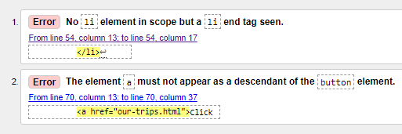
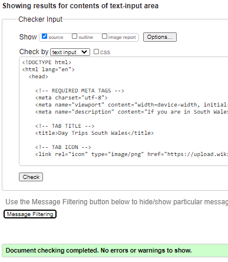

***
## Table of contents
1. [Testing User Stories](#Testing-User-Stories)
2. [Manual Testing](#Manual-Testing)
3. [Automated Testing](#Automated-Testing)    
     - [Code Validation](#Code-Validation)
     - [Lighthouse Auditing](#Lighthouse-Auditing)
     - [Responsiveness](#Responsiveness)

***

## Testing User Stories

#### New Customer Goals:
1. Easily navigate through the website to find relevant information about the service and potentially book the service.

     - The website is structured in three main pages: Home, Our Trips and Book Now!.
     - The links to all the pages are situated on the right top corner of every page for consistency in a well defined Navigation Bar.
     - The logo in on left top corner of the Navigation Bar which redirects the user back to the Home Page when clicked.

2. Learn more about the business and the service they provide.

     - The Home page displays a headline which shows how the customer can benefit from the service.
     - The click here button in the headline takes the user to the second page, where they can view more details about each service provided.
     - The Carousel under the headline contains pictures of the locations provided in the service and also information about the business. 
     - The Meet the team section shows the user exactly who runs the business.
     - The Home page also has a dedicated area for testimonials from previous users of the service with the scope of validating the quality of the service.

3.  See proof of the service, such as pictures, videos or locations.

     - The Our Trips page contains three sections, one for each service provided.
     - Each section contains Tour details and a More details section for images, videos and locations.

4. Easily get in touch with the business to enquire additional information or to book the service.
     - The book now Page contains an accordion form meant to give the user choice regarding the reason for contacting the business.
     - The footer is present on every page, displaying social media icons, which will direct the user to the social media accounts of the business when clicked.

#### Current Customer Goals:
1. Easily navigate through the content in order to book the service again.

     - The Home Page contains a Click Here button which directs the user to the second page, where each service is displayed.
     - Each service section is also accessible from the Navigation Bar, via a dropdown menu under Our Trips.
     - Each section of Our Trips contains a Book-trip Button which directs the user to the Book Now page.
     - The Book Now page is also accessible from the Navigation Bar.

2. Be able to get in touch easily with the business.

     - The footer is present on every page, displaying social media icons, which will direct the user to the social media accounts of the business when clicked.
     - The book now Page contains an accordion form meant to give the user choice regarding the reason for contacting the business.

3. Dedicated area where current users can have their opinions displayed.

     - The Home page has a fourth section for testimonials.

## Manual Testing

I manually tested every element myself to ensure they are functional.

1. I tested the website layout on different browsers to ensure it looked good. I used: Chrome, Safari, Opera, Firefox and Edge.

2. On mobile devices, the website was tested on Iphone 6, Iphone 11 plus and Samsung Galaxy S10. 

3. The contact form:

    - I manually tested the accordion to ensure proper display and functionality.
    - I filled in all permutations of fields, leaving one required field empty each time to make sure I was always prompted to fill in the empty field.
    - I filled in a wrongly formatted email address to test that the user would be prompted to fill in a valid email address. 
 

4. I manually checked each external link, to make sure they are all opening in a new window and to the correct address.

5. I checked that all the internal navigation was working as it should. 

## Code Validators

The code has been validated using [W3 HTML Validator](https://validator.w3.org):

- Home Page Validation
  - When running the Home Page code through the Validator the following errors have been identified:
    
  - The errors have been fixed to achieve the final result:
    

 
 [W3 CSS Validator](https://jigsaw.w3.org/css-validator/)
